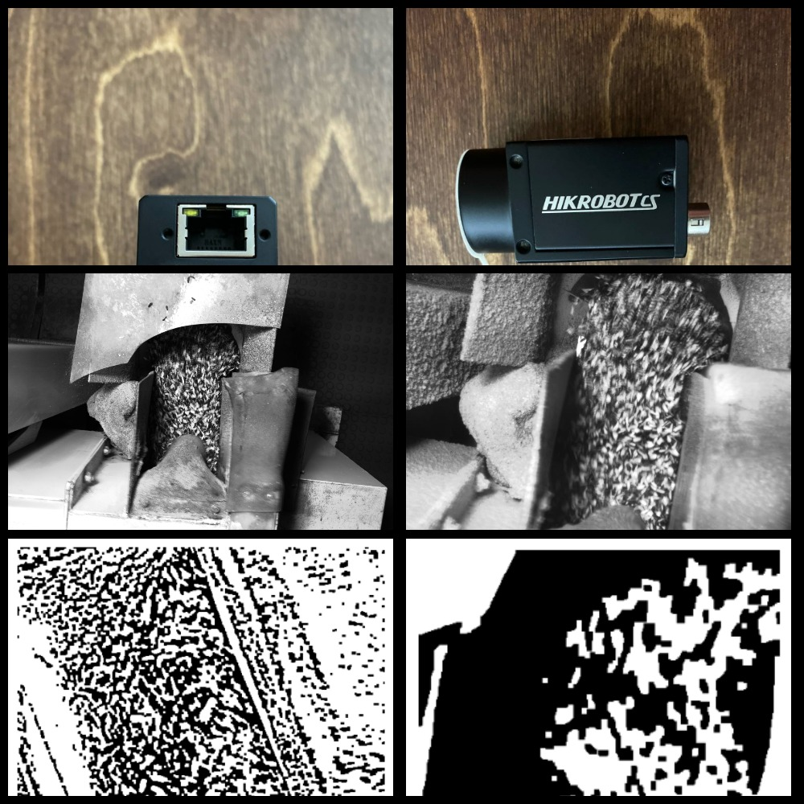

# Привет! Я Александр
**Computer vision engineer и data scientist.**
- Добро пожаловать в моё портфолио! Здесь вы можете найти информацию о моих проектах, демонстрации и описания.
- [Посетить сайт портфолио](https://alnibl.github.io/Portfolio/)
- [Смотреть видеовизитку](https://youtube.com/shorts/EuhiwnNi8RY)

## Мои проекты
### Автоматизация контроля ядер подсолнечника методом компьютерного зрения
- **Описание**: Проект направлен на автоматизацию контроля содержания ядер подсолнечника в шелухе на производстве.
Использованы классические методы компьютерного зрения (бинаризация и фильтрация). Изначально выявлена высокая корреляция (до 0.98) процента белых пикселей с лабораторными измерениями содержания ядер, однако дополнительная перепроверка командой заказчика на кратковременных выбросах показала ограниченность подхода и необходимость дальнейших исследований с применением моделей глубокого обучения.
- **Задачи и результаты**:
1. Сбор и анализ данных с промышленных GigE Vision камер.
2. Подтверждение корреляции между лабораторными замерами и процентом белых пикселей в ряде случаев.
3. Дополнительный эксперимент выявил ограничения текущего метода при коротких выбросах.
- **Использованные технологии**: Python, OpenCV, Aravis, Pandas, NumPy.
- **Изображения / Графики**:

### Система подсчета трафика
- **Описание**: "Система подсчета автомобильного трафика по полосам движения в реальном времени с трекингом и классификацией на базе YOLO и Raspberry Pi."
- **Технологии**: YOLO, Raspberry Pi, OpenCV, Python.
- **Основные особенности**:
1. Трекинг и классификация транспорта в реальном времени.
2. Запись результатов в базу данных.
3. Низкие системные требования, работа на Raspberry Pi.
- **Видео_1**: Детекция, трекинг, подсчет по линиям пересечения:
- 
- **Видео_2**: Добавлена классификация типов транспорта по линиям пересечения(тип авто отображается рядом со счетчиком):
- 
### Сервис OCR + LLM для обработки изображений книг
- **Описание**: Извлечение ключевой информации из изображений книг, обрабатывает около 3000 запросов в день.
- **Технологии**: OCR, LLM, FastAPI, Python.
- **Основные особенности**:
1. Использование LLM для анализа текста.
2. Высокая производительность: обработка тысяч запросов ежедневно.
3. REST API для интеграции с другими системами.
- **Видео**:
- 
### Lipsync и реставрация лиц с использованием GAN
- **Описание**: Реставрация лиц и улучшение качества видео с помощью GAN в рамках рабочего проекта в компании. Работа с моделями lipsync для синхронизации мимики с аудио.
- **Технологии**: Python, Wav2Lip, YOLOv5, tortoise-TTS, GFPGAN, GAN, VideoReTalking, Roop.
- **Основные особенности**:
1. Детекция, идентификация лиц
2. Устранение артефактов в мимике
3. Синхронизация мимики с аудио
4. Использование предобученных моделей и кастомизация.
- **Видео**:
- 
## Контакты
- Email: [alnibl88@gmail.com](mailto:alnibl88@gmail.com)
- GitHub: [Посетить мой профиль](https://github.com/alnibl)
- Telegram: @Alnibl
- **Сайт портфолио:** [https://alnibl.github.io/Portfolio/](https://alnibl.github.io/Portfolio/)
